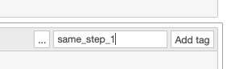
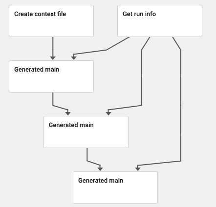

In order to add steps, we need a comment in the notebook itself. This can be done by adding a tag in the notebook, or a comment in the python file.

## Allowing for Adding Specific Tags

First, go to the notebook settings and view "Cell Metadata":

## Add a Tag that Specifies a Step

Second, go to the cell you want to split steps with, and add a tag of the following form: `same_step_x` where `x` is a digit of any length. (We currently only support linear DAG execution so even though we ask for digits, we don't actually do anything with them.)

## Execute the step

Now, when you execute `same program run` the cells will automatically be grouped together into steps, and executed serially. No additional work is necessary for the end user.

We inject two additional steps for each graph, a "run info" step (which is necessary because we only know things like Run ID when the step is executed), and the "context" step (which adds a default, well-formed context dictionary to the graph).
