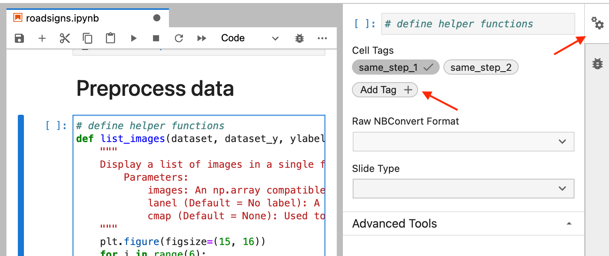

In order to split a notebook into multiple pipeline steps, we add cell tags in the notebook.

## Option 1: Jupyter Lab

### Add a Tag that Specifies a Step

Go to the cell you want to split steps with, and click the "cogs" icon in the top right.
Add a tag of the following form: `same_step_x` where `x` is a digit of any length. (We currently only support linear DAG execution so even though we ask for digits, we don't actually do anything with them.)

## Option 2: Classic Jupyter

### Allowing for Adding Specific Tags

First, go to the notebook settings and view "Cell Metadata":

### Add a Tag that Specifies a Step

Second, go to the cell you want to split steps with, and add a tag of the following form: `same_step_x` where `x` is a digit of any length. (We currently only support linear DAG execution so even though we ask for digits, we don't actually do anything with them.)

## Execute the Steps

Now, when you execute `same run` the cells will automatically be grouped together into steps, and executed serially. No additional work is necessary for the end user.

We inject an additional step for each graph, a "run info" step (which is necessary because we only know things like Run ID when the step is executed).
