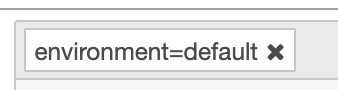
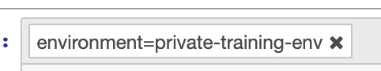
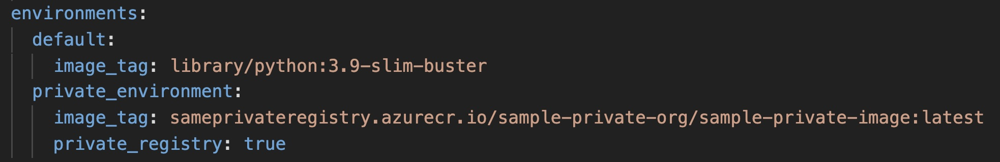

Often times, a specific step will require a particular base image to execute inside of. This may be because the image was pre-built with particular dependencies (packages, libraries, drivers, etc) which Jupyter does not need to execute, but may be necessary on the back end. This feature allows to specify the base image required to execute a given step.

### Editing the Notebook to Allow Tags

First, go to the notebook settings and view "Cell Metadata":


### Adding an Environment Specifier
You can add alternate base images with the following tag structure:

```bash
environment=environment_name
```

For example:

```bash
environment=default
```



or:

```bash
environment=private-training-env
```



### Update SAME File

Then in your SAME file, you'll add a section that maps to the specific image you'll need.


