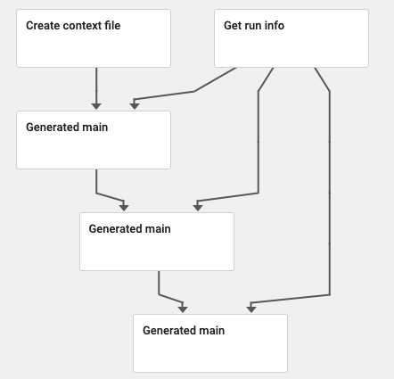

## Clone the Sample Repo

To get started, first you'll need to clone our sample repo. To do so, execute the following command:

```bash
git clone git@github.com:SAME-Project/SAME-samples.git
```

Next, change into the hello-world directory:

```bash
cd hello-world
poetry shell
```

**Note** If you do not have `poetry` installed, this will fail. Make sure you do `python -m pip install poetry` if this is not present.

Finally, deploy your notebook to your environment. If you are using kubeflow, you would execute the following command:

```bash
same program run -t kubeflow
```

This command converts the notebook into a single python script, and deploys it to your [previously configured]() Kubeflow.



To do the same against Azure Machine Learning, you should execute the following command:

```bash
same program run -t aml
```
