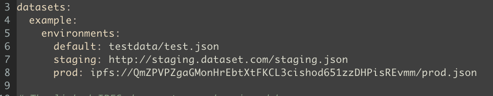
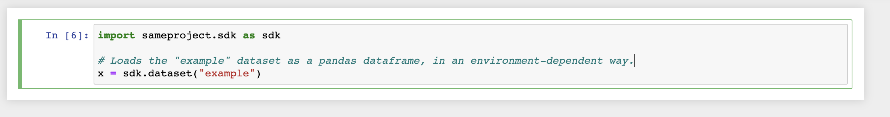

You may wish to use different datasets in your notebook depending on which environment it is deployed to. The [`sameproject` SDK](https://pypi.org/project/sameproject/) allows you to configure [environment](changing-environment.md)-specific datasets in your SAME config file, and load them in a uniform way inside your notebook.

### Add the SDK as a Requirement

First, you will need to add `sameproject` to your configured `requirements.txt` file:

```bash
tensorflow==2.8.0
[...]
sameproject==0.2.2
```

<!-- TODO: link to page on requirements.txt -->

### Update SAME Config

Next, configure environment-specific datasets in the `datasets` section of your `same.yaml` config file:



Note that SAME supports local files and web URLs as well as the IPFS protocol.

### Load the Dataset in your Notebook

Finally, you can load your dataset in an environment-specific way using the `sameproject.sdk` module in your notebook:



When you deploy your notebook to an execution backend using `same run`, the environment that has been specified either through notebook tags or the `--same-env` flag will be used to load the appropriate dataset in your notebook:

```bash
same run --same-env=staging
```
