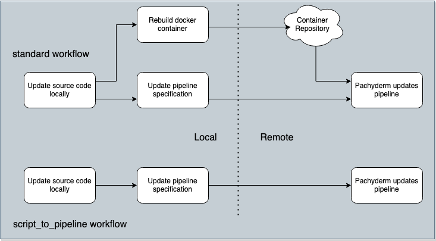

# Script-to-Pipeline

### Beta Development

A utility to help convert python scripts into Pachyderm pipelines easily.
NOTE: This is currently intended for simple pipeline operations and may not
handle more complex use-cases.

This tool is designed to speed up the pipeline development iteration by
sidestepping the need to build, push, and pull containers to test the
changes to your code.



## How To Use

Let's use the Pachyderm's canonical "OpenCV" example that can be found re-implemented
within the [example/](./example) directory. There you will find the 
[edges.py](./example/edges.py) script that runs the Canny edge detection on images:
```python
# example/edges.py
from pathlib import Path
import cv2
from matplotlib import pyplot as plt
from script_to_pipeline import pipeline

@pipeline(dependencies=["opencv-python==4.5.3", "matplotlib==3.5"])
def main():
    """Walk /pfs/images and run edge detection on every image file."""
    image_dir = Path("/pfs/images")
    output_dir = Path("/pfs/out")
    for image_file in filter(Path.is_file, image_dir.glob("**/*")):
        output_file = output_dir.joinpath(
            image_file.relative_to(image_dir)
        ).with_suffix(".png")
        print(f"{image_file} -> {output_file}")

        image = cv2.imread(str(image_file))
        edges = cv2.Canny(image, 100, 200)
        plt.imsave(str(output_file), edges, cmap="gray")
```
Notice above that the function `main` is being marked with the decorator `@pipeline`.
This signals to this utility that this function should be the entrypoint
called by the pipeline.

By running the following bash command from within the [example/](./example) directory
(NOTE: you must be within a virtual environment containing the `opencv-python`
and `matplotlib` packages):
```bash
script_to_pipeline edges.py
```
you will see the following output:
```json
{ "cmd": [ 
    "python3",
    "entrypoint.py",
    "ZnJvbSBw...[shortened]...eSIpCg==",
    "opencv-python==4.5.3",
    "matplotlib==3.5"
  ],
  "image": "bonenfan5ben/skate:dev-07-opencv"
}
```

This information can also be updated within [edges.json](example/edges.json) using the
following bash command:
```bash
script_to_pipeline edges.py --pipeline edges.json
```

## Limitations
* Only single file scripts are (currently) supported.
* You must be within a virtual environment capable of running the script
when executing the `script_to_pipeline` command.